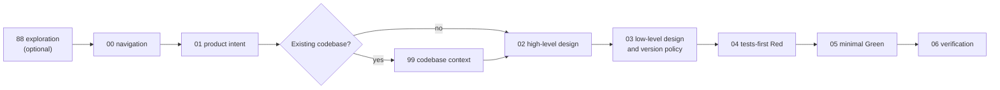
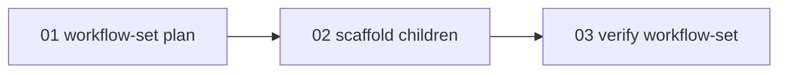

# SLDD Skill

SLDD is a runtime skill for **Spec Loops Driven Development**: a gated, specs-driven workflow for AI-assisted software delivery.

It keeps exploration, product intent, architecture, test design, implementation, and verification in separate phases so agents can move quickly without skipping review gates.

This implementation is based on Loiane Groner's article [Vibe Coding, But Production-Ready: A Specs-Driven Feedback Loop for AI-Assisted Development](https://loiane.com/2026/03/vibe-coding-with-specs-driven-feedback-loops/).

## Install

Install from the Skills CLI:

```bash
npx skills add soujava/sldd-skills
```

Install manually for Claude Code:

```bash
git clone https://github.com/soujava/sldd-skills.git
cp -r sldd-skills/skills/sldd ~/.claude/skills/
```

Install manually for OpenCode:

```bash
git clone https://github.com/soujava/sldd-skills.git
cp -r sldd-skills/skills/sldd ~/.agents/skills/
```

For local development, install the repository skill as a symlink:

```bash
./install-sldd-skills.sh
```

Use `--target <skills-dir>` to choose another skills directory:

```bash
./install-sldd-skills.sh --target ~/.claude/skills
```

Use `--copy` to install a copy instead of a symlink:

```bash
./install-sldd-skills.sh --copy
```

The installer uses `skills/sldd` as the source, defaults to `$HOME/.agents/skills`, removes previous `sldd` and legacy `sldd-*` entries in the target directory, and creates one installed skill at `<target>/sldd`. Reload the consuming tool after changing the skill.

## Commands

SLDD accepts slash-style commands when they reach the skill as text:

```text
/sldd
/sldd help
/sldd status
/sldd start <feature>
/sldd resume <feature>
/sldd resume
/sldd continue
/sldd run step <NN> <feature>
/sldd run step <NN>
/sldd step <NN>
/sldd explore [idea]
```

Commands are routing shortcuts. They do not bypass workflow gates, approval rules, journal checks, or Red/Green contracts.

Use `/sldd help` for a non-mutating overview. It must not load workflow or step files and must not create or change workflow state.

Use `/sldd explore [idea]` for Step 88 exploration before formal Step 01. Exploration establishes project context, inspects the repository before asking questions the codebase can answer, asks one focused question at a time, and offers explicit exits: continue exploring, formalize Step 01, save an optional summary after approval, route to Step 99, or stop without saving.

When exploration reveals multiple capabilities, dependencies, parallel workstreams, or an oversized Step 01, SLDD recommends workflow-set planning. Exploration does not create workflow-set artifacts without explicit approval.

## Architecture

SLDD is one executable skill:

```text
skills/sldd/SKILL.md
```

`SKILL.md` is the router. It detects or recovers the workflow kind, validates journal state, interprets commands, and loads only the workflow and step needed for the current action.

Runtime content is split by responsibility:

| Path | Responsibility |
|---|---|
| `skills/sldd/SKILL.md` | Single executable router |
| `skills/sldd/workflows/` | Workflow-specific ordering, gates, resume rules, and step maps |
| `skills/sldd/steps/<kind>/` | Step behavior, approval protocol, save flow, and response format |
| `skills/sldd/templates/` | Markdown artifact formats |
| `skills/sldd/schema/_spec-journal.schema.json` | Structured journal contract |

The router uses progressive disclosure:

```text
SKILL.md
  -> workflows/<kind>.md
    -> steps/<kind>/<current step of the workflow kind>.md
      -> templates/<artifact>.md only when writing that artifact
```

Do not create additional executable SLDD skills. `skills/sldd/SKILL.md` remains the only entrypoint.

The current runtime package has no application code, package manager, build pipeline, or secondary runtime entrypoint. It is a documentation-first skill package made of the router, workflow files, step files, artifact templates, the journal schema, repository documentation, evaluations, and the local installer.

## Workflow Kinds

SLDD supports two workflow kinds:

| Kind | Use for |
|---|---|
| `feature` | Isolated features, bugfixes, endpoints, business rules, local refactors, component documentation, and other single-workflow changes |
| `workflow-set` | Large initiatives, products, epics, multi-module work, broad system plans, decomposition requests, and work that needs child workflows |

New journals persist `kind` as soon as the workflow is created. Existing journals with `kind` use that value as the source of truth. Existing journals without `kind` are treated as `feature` for legacy compatibility and are not rewritten solely to add `kind`.

When the request is ambiguous, SLDD chooses `feature` unless the user clearly asks for decomposition or the work has multiple independent deliverables.

## Feature Workflow

Feature workflows use this route:



Formal gate order is:

```text
01 -> 99 when needed -> 02 -> 03 -> 04 -> 05 -> 06
```

Step 99 is required before Step 02 for existing codebases. It may run during Step 88 when brownfield context is needed, but it satisfies the gate only after `existing-codebase-understanding.md` is approved, saved, current, and marked complete.

Feature step files:

| Step | File | Purpose |
|---|---|---|
| 88 | `steps/feature/88-exploration.md` | Clarify rough ideas before formal Step 01 |
| 00 | `steps/feature/00-navigation.md` | Inspect state and route |
| 01 | `steps/feature/01-product-intent.md` | Product intent and acceptance criteria |
| 99 | `steps/feature/99-codebase-context.md` | Existing-codebase context |
| 02 | `steps/feature/02-high-level-design.md` | High-level technical design |
| 03 | `steps/feature/03-low-level-design.md` | Low-level design and version policy |
| 04 | `steps/feature/04-tests-red.md` | Tests-first Red phase |
| 05 | `steps/feature/05-implementation-green.md` | Minimal Green implementation |
| 06 | `steps/feature/06-verification.md` | Verification and Go/No-Go |

Core feature rules:

- No implementation prompts or code changes before Step 01, Step 02, and Step 03 are approved.
- Step 88 context is conversational and non-binding unless formalized into approved numbered artifacts.
- Step 04 writes tests first and must stay Red-only.
- Step 05 makes the minimum production changes needed to pass Step 04 tests and must not modify Step 04 tests.
- Step 04 records `evidence: "red_confirmed"` in the journal; Step 05 records `evidence: "green_confirmed"`.
- Step 04 and Step 05 are journal-evidence phases, not mandatory Markdown report phases.
- Step 06 produces `06-verification-and-feedback-report.md`.
- If `relationships.predecessors` exists, every predecessor journal must exist and have Step 06 complete before this workflow may complete Step 01 or route to Step 02+.

## Workflow-Set Workflow

Workflow-set parents decompose large work into child feature workflows:



Workflow-set parent steps:

| Step | File | Purpose |
|---|---|---|
| `01-workflow-set-plan` | `steps/workflow-set/01-workflow-set-plan.md` | Parent decomposition plan |
| `02-scaffold-children` | `steps/workflow-set/02-scaffold-children.md` | Create approved child workflow drafts |
| `03-verify-workflow-set` | `steps/workflow-set/03-verify-workflow-set.md` | Verify coordination consistency |

Workflow-set parents plan and scaffold children. They do not execute child workflows, approve child Step 01, enforce child implementation gates, or persist child execution progress.

Creating or updating a workflow-set parent requires explicit approval. A new parent journal is created only through `01-workflow-set-plan`; existing journals without `kind` remain legacy-compatible `feature` workflows and are not auto-converted into workflow-sets. Existing `kind: "feature"` journals stop the workflow-set path unless the user chooses another workflow-set name or gives explicit direction.

Child scaffolding requires:

- a completed `01-workflow-set-plan`;
- separate explicit approval to scaffold;
- stable child names, titles, kinds, scopes, and predecessor references;
- no predecessor cycles;
- no unsafe overwrite without explicit approval.

Scaffold is all-or-nothing for the proposed children in the approved plan. Invalid plans create no children and keep `02-scaffold-children` pending. Filesystem collisions or unsafe overwrite risks may be recorded as `conflict` only after explicit user approval.

Created child workflows are normal `feature` workflows. Each child starts with Step 01 `pending` and `origin.type: "workflow-set-scaffold"`. Child predecessor gates require listed predecessor journals to complete Step 06 before the child can complete Step 01 or route to Step 02+.

Parent status may compute child progress by reading child journals, but computed child progress is never written into the parent journal.

`03-verify-workflow-set` verifies coordination state in the conversation and journal only. It does not create a dedicated verification report artifact in the current workflow-set version. Verification may complete with accepted scaffold conflicts only when the user explicitly accepts preserving those conflicts for later resolution.

## Storage

New workflows store artifacts under:

```text
.sldd/specs/<feature-name>/
```

The canonical journal is:

```text
.sldd/specs/<feature-name>/_spec-journal.json
```

Common feature artifacts:

```text
00-exploration-summary.md
01-product-intent-specification.md
existing-codebase-understanding.md
02-high-level-technical-design.md
03-low-level-design-and-version-policy.md
06-verification-and-feedback-report.md
```

Workflow-set parents also use:

```text
01-workflow-set-plan.md
```

Workflow-set Step 03 does not write a separate verification artifact. Scaffolded child workflows write their own `01-product-intent-specification.md` from `templates/01-product-intent-from-workflow-set.md`.

Child workflows scaffolded from a workflow-set get their own `.sldd/specs/<child-name>/` directory and journal.

Legacy workflows using `docs/specs/<feature-name>/SPEC.md` remain readable for resume compatibility. When resuming a legacy workflow, SLDD keeps writing in that legacy directory unless the user explicitly requests migration.

## Journal Contract

`_spec-journal.json` is journal-only state. It records progress, artifact links, evidence, relationships, workflow kind, reasons, notes, and workflow-set scaffold state. It must not contain numbered artifact body content, command logs, or implementation reports.

Required top-level fields in the current schema:

| Field | Contract |
|---|---|
| `schema_version` | Must be `1` |
| `feature` | Workflow name |
| `workflow` | Must be `sldd` |
| `kind` | `feature` or `workflow-set` |
| `steps` | Step status map |

Other supported fields include `title`, `current_step`, `relationships.parents`, `relationships.predecessors`, `workflowSet.children`, and `notes`.

Allowed step statuses:

```text
pending
complete
requires_rerun
```

Step entries may include `artifact`, `evidence`, `reason`, `updated_at`, and `origin`. `origin.type` is currently used for `workflow-set-scaffold`.

Workflow-set child entries require `name`, `title`, `kind`, and `scaffold`. Child `kind` is always `feature`. Scaffold state is one of:

```text
proposed
created
conflict
```

For `kind: "workflow-set"`, the schema requires workflow-set step keys, workflow-set `current_step` values, and `workflowSet.children`.

## Reruns

When a requested step is already `complete`, SLDD stops before loading the step and asks whether to:

1. Run it again only.
2. Run it again and mark later completed steps as `requires_rerun`.
3. Do nothing.

Option 1 is an explicit override. Option 2 marks later completed steps in the selected workflow order as `requires_rerun`. When invalidating Step 04 or Step 05, clear `evidence` and keep any artifact link only as historical reference.

## Development Rules

- Keep `skills/sldd/SKILL.md` as the only executable SLDD skill entrypoint.
- Keep workflow behavior under `skills/sldd/workflows/`.
- Keep step behavior under `skills/sldd/steps/`.
- Keep artifact formats under `skills/sldd/templates/`.
- Keep journal schema files under `skills/sldd/schema/`.
- Preserve YAML frontmatter in `skills/sldd/SKILL.md`: `name`, `description`, and `metadata.type`.
- Preserve progressive disclosure from router to workflow to one current step.
- Preserve `.sldd/specs/<feature-name>/_spec-journal.json` as the canonical journal for new workflows.
- Preserve legacy `docs/specs/<feature-name>/SPEC.md` resume compatibility until explicitly removed.
- Preserve `/sldd help` as informational and non-mutating.
- Preserve the Step 88/Step 99 boundary: exploration context is conversational; Step 99 is approved, saved brownfield context.
- Preserve the Step 04/Step 05 Red-Green contract.
- Preserve workflow-set parent sequencing: `01-workflow-set-plan -> 02-scaffold-children -> 03-verify-workflow-set`.
- Preserve workflow-set parent boundaries: parents do not execute children or persist child progress.
- Update this README when process behavior, sequencing, gates, approval semantics, commands, journal fields, storage, templates, installer options, or step responsibilities change.

Use Conventional Commits:

```text
<type>(optional-scope): <description>
```

## Further Reading

- [Vibe Coding, But Production-Ready: A Specs-Driven Feedback Loop for AI-Assisted Development](https://loiane.com/2026/03/vibe-coding-with-specs-driven-feedback-loops/)
- [Claude Code custom instructions](https://docs.anthropic.com/en/docs/claude-code/tutorials#custom-instructions)
- [OpenCode skills](https://opencode.ai/docs/skills)
- [Cursor rules](https://docs.cursor.com/context/rules-for-ai)
- [GitHub Copilot custom instructions](https://docs.github.com/en/copilot/customizing-copilot/adding-custom-instructions)

## License

The SLDD methodology and original article content are by Loiane Groner and licensed under [CC BY 4.0](https://creativecommons.org/licenses/by/4.0/).

This skills implementation is provided for community use.
