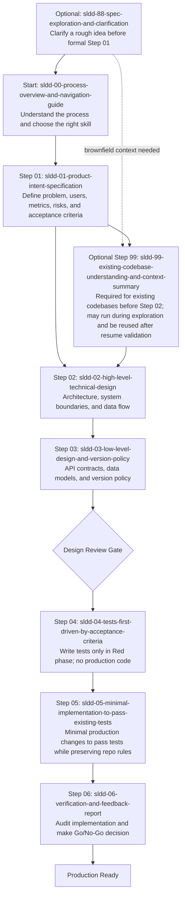

# SLDD Skills - Spec Loops Driven Development

A collection of AI skills for implementing **Spec Loops Driven Development (SLDD)**, a specs-driven feedback loop for AI-assisted development.

## Overview

SLDD (Spec Loops Driven Development) is a methodology that adds engineering control around AI-assisted coding, enabling teams to maintain speed without sacrificing quality. This repository contains ready-to-use runtime skills that implement the SLDD process.

### Based On

This work is based on the article **["Vibe Coding, But Production-Ready: A Specs-Driven Feedback Loop for AI-Assisted Development"](https://loiane.com/2026/03/vibe-coding-with-specs-driven-feedback-loops/)** by [Loiane Groner](https://loiane.com/).

> **The goal is not to stop vibe coding. The goal is to add engineering control around vibe coding so we can keep speed without sacrificing quality.**
>
> — Loiane Groner

## What Problem Does SLDD Solve?

When using AI for code generation, teams often face:

- **Version drift**: AI selects framework versions that don't align with team policy
- **Missing non-functional requirements**: Security, observability, maintainability
- **Diluted product intent**: Implementation starts before design is clear
- **Architecture confusion**: Plausible codebase mistaken for valid architecture

SLDD provides a structured feedback loop that prevents these issues while maintaining development velocity.

## Installation

### Using Skills CLI (Recommended)

Install all SLDD runtime skills with a single command:

```bash
npx skills add soujava/sldd-skills
```

This will automatically download and configure the executable SLDD skills for your AI agent.

### Manual Installation

#### For Claude Code

Copy the skill directories to your Claude skills folder:

```bash
# Clone the repository
git clone https://github.com/soujava/sldd-skills.git

# Copy to Claude skills directory
cp -r sldd-skills/skills/sldd-* ~/.claude/skills/
```

#### For OpenCode

Copy the skill directories to your OpenCode skills folder:

```bash
# Clone the repository
git clone https://github.com/soujava/sldd-skills.git

# Copy to OpenCode skills directory
cp -r sldd-skills/skills/sldd-* ~/.agents/skills/
```

#### Development Symlink Installation

During development, use the repository script to install SLDD skills as symbolic links instead of copying them:

```bash
./install-sldd-skills.sh
```

This is useful when editing the skills locally because changes made under `skills/` are immediately visible to tools that read from `$HOME/.agents/skills`.

After changing a skill, reload or restart the CLI/tool that consumes the skills so it refreshes the loaded skill instructions. The symbolic link updates the file location, but the tool may cache skill content for the current session.

The script:

- uses `skills/` in this repository as the source directory;
- creates `$HOME/.agents/skills` if it does not exist;
- removes previous `sldd-*` symbolic links from `$HOME/.agents/skills`;
- removes previous real `sldd-*` directories from `$HOME/.agents/skills`;
- skips non-directory files that match `sldd-*`;
- creates one symbolic link per `skills/sldd-*` directory;
- prints a summary with removed links, removed directories, skipped files, and created links.

Symbolic links are removed as links only. The script does not delete the files or directories that those links point to.

Use this only for local development. For published or end-user installation, prefer the Skills CLI or the manual copy instructions above.

#### For Other AI Tools

These skills are plain Markdown files with YAML frontmatter. They can be adapted to any AI tool that supports:
- System prompts or instructions
- Reusable prompt templates
- Agent/skill workflows

## The Process Flow

Run one skill at a time. Review and approve the output before moving to the next step.

All executable skills are standalone at runtime. They do not depend on shared helper skills or a separate Step 88 protocol being loaded for gates, approvals, save behavior, or artifact headings.



### Gate Rule

**No implementation prompts (steps 04-05) before intent and design (steps 01-03) are reviewed and approved.**

For brownfield projects, `sldd-99-existing-codebase-understanding-and-context-summary` is required before Step 02. It may run during Step 88 exploration when understanding the current codebase is necessary to clarify scope, constraints, risks, or alternatives. A Step 99 completed during exploration can be reused later only after the agent validates that it still reflects the current codebase and remains relevant to the approved Step 01 scope.

Step 04 and Step 05 may execute directly when the approved artifacts make the scope clear. Step 04 must stay Red-only. Step 05 must implement only the minimum production changes required to pass Step 04 tests, must not modify tests, and must inspect and follow applicable repository instructions and agentic instructions present in context.

If a gap appears at any step, loop back to the earlier step and revise.

## Skills Included

The `skills/` directory contains executable runtime skills only. Non-runtime shared helper/reference skills are intentionally not kept under `skills/`.

| Step | Skill | Description |
|------|-------|-------------|
| 88 | `sldd-88-spec-exploration-and-clarification` | Clarify rough ideas before formal Step 01 |
| 00 | `sldd-00-process-overview-and-navigation-guide` | Navigate the SLDD process and choose the correct skill |
| 01 | `sldd-01-product-intent-specification` | Define problem, users, metrics, risks, acceptance criteria |
| 02 | `sldd-02-high-level-technical-design` | Architecture diagram, component responsibilities, data flow |
| 03 | `sldd-03-low-level-design-and-version-policy` | API contracts, data models, error handling, version policy |
| 04 | `sldd-04-tests-first-driven-by-acceptance-criteria` | Write tests first in strict TDD mode |
| 05 | `sldd-05-minimal-implementation-to-pass-existing-tests` | Minimal code to make tests pass while preserving repository and agent instructions |
| 06 | `sldd-06-verification-and-feedback-report` | Audit implementation, compliance matrix, go/no-go decision |
| 99 | `sldd-99-existing-codebase-understanding-and-context-summary` | Read and summarize existing codebase for brownfield exploration and Step 02 readiness |

## Usage

### Starting a New Feature

1. If the idea is still rough, use `sldd-88-spec-exploration-and-clarification`.
2. Begin or resume with `sldd-00-process-overview-and-navigation-guide` to choose the correct next skill.
3. Run `sldd-01-product-intent-specification` to define product intent.
4. For existing codebases: run `sldd-99-existing-codebase-understanding-and-context-summary` before Step 02, or earlier during exploration if codebase context is needed to clarify the feature.
5. Follow steps 02-06 in sequence.
6. Review each step output before proceeding. Artifact-producing steps require explicit approval before persistence; execution steps 04-05 may run directly only when their approved inputs, commands, and scope are clear.

### For Existing Codebases

Run `sldd-99-existing-codebase-understanding-and-context-summary` to ground exploration and design decisions in the current architecture. If exploration depends on codebase details, Step 99 may be run before formalizing Step 01. If Step 99 was completed during exploration, `sldd-00-process-overview-and-navigation-guide` should validate freshness and relevance before reusing it for Step 02.

If the saved Step 99 context is stale, incomplete, scoped to a rejected exploration direction, or marked as requiring rerun on resume, update or rerun Step 99 before proceeding to `sldd-02-high-level-technical-design`.

### For Greenfield Projects

Skip sldd-99 and proceed directly from sldd-01 to sldd-02.

### Example Invocation

When using an AI tool that supports skills:

```
/sldd-01-product-intent-specification

Feature idea: Build a user authentication system with email/password and OAuth providers (Google, GitHub)
```

The skill will guide the AI to produce a structured product intent specification.

## Key Principles

### 1. Vibe Coding + Specs-Driven = Production Ready

- **Vibe coding**: Excellent for discovery and fast prototypes
- **Specs-driven**: Essential for production decisions
- **The winning model**: Both, in sequence

### 2. Decision Framework

| Context | Approach |
|---------|----------|
| Early discovery | Vibe coding first |
| User-facing in production | Specs-driven loop first |
| Migration or platform work | Include explicit version checks |

### 3. The Engineer's Role

The role shifts from writing every line to **orchestrating and validating**:
- Define intent and constraints
- Review architecture decisions
- Verify correctness
- Own what gets committed

### 4. TDD Throughout

Tests are written **before** implementation:
- Unit tests for logic
- Integration tests for data boundaries
- E2E tests for user-visible flows

## Benefits

| Before SLDD | After SLDD |
|-------------|------------|
| Version drift discovered late | Version policy enforced upfront |
| Missing non-functional requirements | Security, observability designed in |
| Scope creep from unclear acceptance criteria | Explicit Given/When/Then criteria |
| Expensive rework after release | Gaps caught during design |
| Unreliable estimates | Structured decomposition enables accurate estimates |

## Team Working Agreement

A lightweight process to adopt:

1. No implementation prompts before intent + design are approved
2. Every AI-generated project includes a version validation step
3. Architecture changes during coding require a design delta note
4. PRs include a spec compliance checklist
5. Release readiness requires explicit support-lifecycle verification

## Skill Architecture and Maintenance

This repository keeps the runtime model simple:

- `skills/` contains only executable skills.
- Each executable `SKILL.md` is self-sufficient at runtime.
- Do not add shared runtime helper skills for gates, approvals, save decisions, or artifact headings.
- If a rule is needed at execution time, include it directly in the executable skill that needs it.
- If the SLDD process changes, update the affected executable skills and this README in the same change.
- Preserve YAML frontmatter with `name`, `description`, `metadata.step`, and `metadata.type`.
- Preserve gate enforcement, explicit approval before persistence, and `SPEC.md` journal-only behavior.
- Keep `00-exploration-summary.md` contextual only; approved numbered artifacts define binding decisions.
- Keep Step 04 tests-first and Red-only before Step 05.
- Keep Step 05 implementation minimal, do not modify Step 04 tests, and preserve repository or context-provided agent instructions during implementation.

## Further Reading

- [Vibe Coding, But Production-Ready - Original Article by Loiane Groner](https://loiane.com/2026/03/vibe-coding-with-specs-driven-feedback-loops/)

## AI Tools Skills Documentation

- [Claude Code - Custom Instructions](https://docs.anthropic.com/en/docs/claude-code/tutorials#custom-instructions)
- [OpenCode - Skills System](https://opencode.ai/docs/skills)
- [Cursor - Rules for AI](https://docs.cursor.com/context/rules-for-ai)
- [GitHub Copilot - Custom Instructions](https://docs.github.com/en/copilot/customizing-copilot/adding-custom-instructions)

## License

The SLDD methodology and original article content are by Loiane Groner, licensed under [CC BY 4.0](https://creativecommons.org/licenses/by/4.0/).

This skills implementation is provided for community use.

## Contributing

Contributions are welcome! Please feel free to submit issues or pull requests to improve the skills, add examples, or enhance documentation.

## Acknowledgments

- **Loiane Groner** for creating and sharing the SLDD methodology
- The broader AI-assisted development community for advancing responsible AI coding practices
